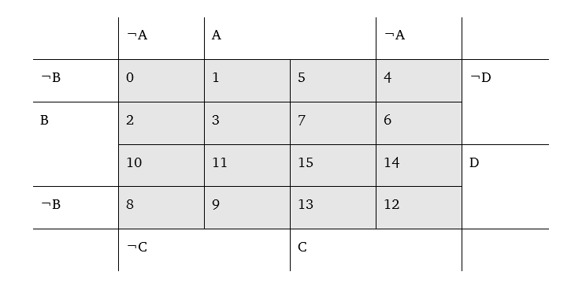
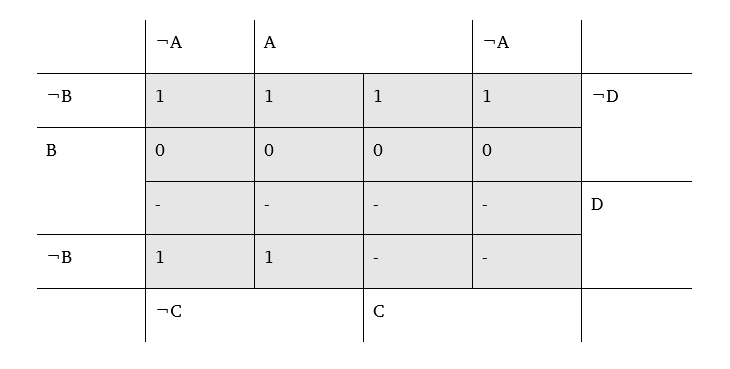
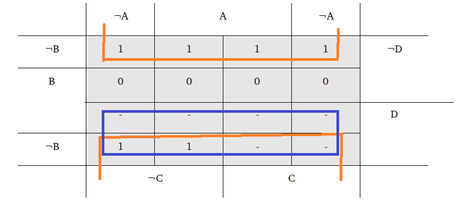

== Aussagen Logik

[quote,unbekannt,Definition einer logischen Aussage]
Eine Aussage ist ein Satz, dem entweder der Wahrheitswert „falsch“ (0) oder „wahr“ (1) zugeordnet werden kann.
Die Logische Verknüpfung von Aussagen ergibt neue logische Aussagen.
Logische Verknüpfungen werden als Junktoren bezeichnet.

===	Grundregeln

Wenn stem:[A] und stem:[B] logische Aussagen darstellen dann gilt:

*Negation* stem:[¬A]: ist wahr, wenn stem:[A] falsch ist.

*Konjunktion* stem:[A ∧ B]: ist wahr, wenn stem:[A] und stem:[B] wahr sind.

*Nicht ausschließende Disjunktion/Logisches Oder* stem:[A ∨ B]: ist wahr, wenn stem:[A] oder stem:[B] wahr oder stem:[A] und stem:[B] wahr ist.

*Implikation* stem:[A ⇒ B]: ist wahr, wenn stem:[A] falsch oder stem:[B] wahr ist, wenn dann. „wenn es regnet ist die Straße nass, die Straße kann nass sein, wenn es nicht regnet aber wenn es regnet muss die Straße nass sein!“

*Äquivalenz* stem:[A ⇔ B]: ist wahr, wenn stem:[A] und stem:[B] denselben Wahrheitswert haben.

*Antivalenz* stem:[A] oder mit Punkt oder stem:[XOR], exklusives oder.
Ist genau dann wahr, wenn entweder stem:[A] oder stem:[B] wahr ist aber nicht, wenn beide wahr sind.

=== Gesetze der Aussagenlogik

. *Doppelte Negation:* stem:[¬(¬A)=A]

. *Idempotenz:* stem:[A ∧A=A=A ∨A]

. *Komplementarität:* A ∧0=0 ;A ∨0=A

. *Kommutativität:*  stem:[A ∨B ⇔B ∨A;A ∧B ⇔B ∧A]

. *Assoziativität:* stem:[(A ∨ B ) ∨ C ⇔ A ∨ ( B ∨ C)] ebenso beim *logischen UND* stem:[∧]

. *Distributivität:* stem:[(A ∨ B)∧ C ⇔ (A ∧ C)∨ (B ∧ C);]
stem:[(A ∧ B) ∨ C ⇔ (A ∨ C) ∧ (B ∨ C);]

. *Transitivität:* stem:[(A ⇒ B) ∧ (B ⇒ C) ⇔ (A ⇒ C)]

. *Absorbtion:* stem:[A ∧ (A ∨ B ) ⇔ A; A ∨ (A ∧ B ) ⇔ A]

. *De Morgansche Gesetze:* stem:[¬(A ∧B)⇔(¬A ∨ ¬B); ¬(A ∨B) ⇔(¬A ∧¬B)]

. *Ersetzen der Antivalenz:* stem:[A\ XOR\ B ⇔(A ∧ ¬B)∨(¬A ∧B)]

. *Ersetzen der Äquivalenz:* stem:[(A ⇔B) ⇔(A ⇒B )∧(B ⇒A)]

. *Ersetzen der Implikation:* stem:[(A ⇒B ) ⇔¬A ∨ B]

. *Negation der Äquivalenz:* stem:[¬(A ⇔B) ⇔(A ∧¬B)∨(¬A ∧B)]

. *Negation der Implikation:* stem:[¬(A ⇒B)⇔A ∧ ¬B]

Wenden wir die Gesetze am Beispiel der Äquivalenz an erhalten wir:

stem:[(A ⇔B) ⇔(A ⇒B )∧(B ⇒A) ⇔(¬A ∨B)∧(¬B∨A)]

sowie

stem:[¬(A ⇔B) ⇔(A ∧¬B)∨(¬A ∧B)⇔(B ⇒A) ∨(A ⇒B)]

=== Wahrheitstabellen

Unter einer Wahrheitstabelle versteht man eine Tabellarische Aufstellung einer Logischen Aussage wobei die Aussage in Ihre Bestandteile zerlegt wird und nach und nach Nachgewiesen wird.
So lässt sich anhand einer Wahrheitstabelle z.B. die Richtigkeit der Negation der Implikation oder eines der De Morganschen Gesetzte nachweisen.
Dazu werden erst alle einzelnen Aussagen als Bits betrachtet.

Bit Schreibeise:
A sei das niedrigste Bit und C das höchste, somit gilt C B A:
Tabellarisch würde das anhand der De Morganschen Gesetze wie folgt aussehen:

.Beweis der De Morganschen Gesetze anhand einer Wahrheitstabelle
|===
|B |A | ¬B |¬A |A ∧ B |¬(A ∧ B) |¬A ∨ ¬B

|0|0|1|1|0|1|1
|0|1|1|0|0|1|1
|1|0|0|1|0|1|1
|1|1|0|0|1|0|0
|===

=== Aussagen anhand logischer Gesetze vereinfachen

Logische Aussagen sind nicht immer direkt als solche ersichtlich.
Häufig müssen diese aus einem Text herausgelesen und als solche interpretiert werden.
Ein Beispiel soll die folgende Aufgabe darstellen.
Wenn Person A schuldig dann ist Person B unschuldig, wenn Person B schuldig dann sind Person B und C unschuldig.
Es liest sich herauslesen, dass es sich um 3 bedingte Aussagen handelt die wir mit Hilfe der Logischen gesetzte vereinfachen und ggf. lösen können.
Demnach entsteht folgende Logische Aussage.

stem:[(A ⇒ ¬B)∧(B ⇒¬(A ∧C))]

Da wir die Implikationen auflösen können sowie das De Morgansche anwenden können erhalten wir im nächsten schritt

stem:[(A ⇒ ¬B)∧(B ⇒¬(A ∧C)) ⇔ (¬A ∨¬B)∧(¬B ∨¬A ∨ ¬C)]

Laut Absorbtions gesetzt gilt:

stem:[A ∧ ( A ∨ B ) ⇔ A]

Von dieser Tatsache können wir profitieren in dem wir sagen,

stem:[(¬A ∨¬B)∧(¬B ∨¬A ∨ ¬C)⇔(¬A ∨¬B)]

Wenden wir erneut das De Morgansche gesetz an erhalten wir:

stem:[(¬A ∨¬B) ⇔¬(A∧B)]

=== Das KV Diagramm

KV Diagramme dienen zum Vereinfachen von Schaltungen.
Wir erhalten beim Ablesen der Schaltung aus dem Diagramm die bereits vereinfachte Schaltungslogik womit das weitere Anwenden logischer Gesetzte entfällt.

|===
|D    |C    |B    |A    |a |-

|0    |0    |0    |0    |0    |0
|0    |0    |0    |1    |0    |1
|0    |0    |1    |0    |1    |2
|0    |0    |1    |1    |1    |3
|0    |1    |0    |0    |0    |4
|0    |1    |0    |1    |0    |5
|0    |1    |1    |0    |1    | 6
|0    |1    |1    |1    |1    | 7
|1    |0    |0    |0    |1    | 8
|1    |0    |0    |1    |1    | 9
|1    |0    |1    |0    |-    |10
|1    |0    |1    |1    |-    |11
|1    |1    |0    |0    |-    |12
|1    |1    |0    |1    |-    |13
|1    |1    |1    |0    |-    |14
|1    |1    |1    |1    |-    |15
|===

Beim Erstellen des KV-Diagrames, kommt es nicht auf die Reihenfolge der Bits an es ist zu beachten, dass die Werte korrekt in das Diagramm eingetragen werden.

.KV-Grundstruktur mit 4 bits

Werden im KV Diagramm die Bits entsprechend ihrer Positionierung eingetragen erhalten wir

.KV Bits eingetragen

Im nächsten Schritt müssen wir uns entscheiden, ob wir negiert entwickeln oder herkömmlich(0 oder 1).

Beim Verknüpfen gelten Folgende Regeln:
• Es dürfen immer nur 2n Felder verknüpft werden.
• Es muss immer das größt möglichste Block verknüpft werden.
• Es darf über Ränder und ecken verknüpft werden, jedoch nicht diagonal.
• Jeder Block wird mit einem logischen oder (∨) verknüpft Lesen wir das KV Diagramm mit diesen Regeln erhalten wir:

.KV Diagramm mit markierten Blöcken

So ergibt sich die vereinfachte logische Aussage: stem:[D ∨ (¬D ∧ ¬B)]  die für a gültig ist.
Somit kann eine optimierte Schaltung für a gebaut werden.