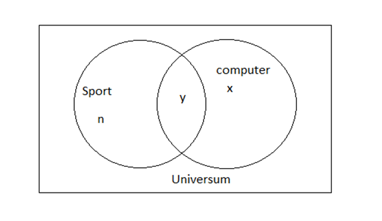

== Mengen
:stem:

Zunächst sollten wir uns in Gedanken rufen was eigentlich eine Zahl ist.
Bei Einer Zahl handelt es sich in erster Linie um eine Repräsentation eines wertes.
So bedeutet 1 z.B. das etwas 1mal vorkommt, sprich es hat die Menge 1.
Grundlagen Mengen müssen in einem Universum definiert sein, sprich sie müssen eine Grundmenge haben diese wird häufig als Omega (stem:[\Omega]) angegeben und Stellt das Universum dar.
Dieses kann wie folgt aussehen stem:[\Omega={0;1;2;..;10}] somit fasst unser Universum alle Natürlichen Zahlen bis einschließlich 10.
Die Lehre Menge Die Lehre Menge Ø oder auch {}, ist die Menge ohne Elemente, sie ist Teilmenge jeder Menge.
Somit gilt: stem:[Ø ⊆] jeder Menge .

=== Universum

Wir können unser Universum auch auf eine nicht explizite Weise angeben.
Haben wir eine unbestimmte Anzahl an Elementen können wir schlicht weg sagen das A im z.B. Universum der natürlichen Zahlen liegt sprich, unser Universum ist ℕ.

=== Schnittmenge

Unter der Schnittmenge lässt sich verstehen, dass es die Menge der Elemente aus A ist die auch in B vorkommt.

Sei stem:[A = {1;2;3}] und stem:[B = {2;3;4}] so ist stem:[A∩B={2;3}]
da die Schnittmenge aus A und B
stem:[{a ∈A,b∈B | a∈B ∧b∈A}]

=== Vereinigung

Die Vereinigung aus zwei mengen lässt sich ein wenig wie eine Art Addition verstehen.
Man nimmt die distinkten (einzigartigen) Elemente aus beiden Mengen und vereinigt diese zu einer neuen Menge.
Sei stem:[A = {1;2;3}] und stem:[B = {2;3;4}]
so sei  stem:[A∪B={1;2;3;4}]
da stem:[{a∈A,b∈B|n∈A ∨n∈B}]

=== Kompliment

Das Kompliment einer Menge ist mit der Negation der Menge gleichzusetzen.
Wir können sagen das das Kompliment aus Menge stem:[A = {1;2;3}] im Universum stem:[\Omega = {0;1;2;3;4;5;6;7}] Nicht stem:[A] ist und somit stem:[\Omega\A] oder stem:[A^c] . Entsprechend ist stem:[A^c⇔ \Omega\A={0;4;5;6;7}]

=== Intervalle

Intervalle definieren ununterbrochene Zahlenfolgen im Universum.
Dabei müssen wir unter offenen und geschlossenen Intervallen unterscheiden.

==== Geschlossenes Intervall

Bei einem geschlossenen Intervall handelt es sich um ein Intervall das alle zahlen in der angegebenen menge einschließt.
Nehmen wir das Intervall stem:[A=\[0;5\]]  stem:[a in A| a in N].
Intervall A umfasst alle Natürlichen Zahlen a von 0 bis 5. Entsprechend ist es die Menge stem:[A= {0;1;2;3;4;5}].

==== Offene Intervalle

Im Gegensatz zu einem geschlossenen Intervall exkludiert ein Offenes Intervall seine Grenzen, man könnte es als Limes verstehen, es nähert sich seinen Grenzen an wird diese aber nie erreichen.
Nehmen wir stem:[A=(0;5) ,a in A|a in N].
Die Menge A wäre nach Definition stem:[A = {1;2;3;4}]

==== Teiloffene Intervalle

Offene Intervalle können mit einander kombiniert werden, so kann man z.B. die Natürlichen sowie die Ganzen Zahlen als Kombination aus Intervallen angeben.
stem:[N=(0;∞)]
stem:[N_0=[0;∞)]
stem:[Z=(-∞;∞)]

=== Potenzmengen

Bei der Potenzmenge handelt es sich nicht um die Mächtigkeit einer Menge, sondern die aus deren Elementen resultierenden Kombinationen.
Sprich Sie gibt an wie viele verschiedene Mengen sich aus der Menge ergeben.
Nehmen wir die Menge A = {1;2;3} dann erhalten wir für die Mächtigkeit stem:[|P^A | {{};{1};{2};{3};{1;2};{1;3}{2;3};{1;2;3}}= 8].
Somit lässt sich sagen, stem:[P^A  = 2^|A|]

=== Kartesische Produkt

Die Multiplikation aus zwei Mengen, oder das Kartesische Produkt ist prinzipiell eine Menge von Mengen die Kombinationen aus den Mengen der Multiplizierten Mengen enthält.
So lässt sich aus stem:[A={1;2}] und stem:[B={2;3}]
stem:[A × B={{1;2};{1;3};{2;2};{2;3}}]
Somit ist auch stem:[|A×B|=4] und stem:[P^|A×B| =2^4=16]
Bei der Ermittlung des Kartesischen Produktes Vereinigt man jedes Element aus Menge A mit den Elementen aus Menge B und erhält Mengen der Summe der Mächtigkeit der einzelnen Elemente in unserem Fall: stem:[|a| = 1] und stem:[|b| = 1] wobei stem:[a in A,b in B] somit haben die Elemente aus stem:[A×B] eine Mächtigkeit von 2.
stem:[n in A×B| |n|=2]

=== Venn-Diagramm

Venn Diagramme dienen dazu Mengen Graphisch darzustellen und so zu eindeutigen Ergebnissen kommen zu kommen.
Zu Grunde liegt das wir nicht immer eindeutige angeben oder absolute Mengen gegeben haben.
So kann es vorkommen das Wir die absolute Anzahl des Universums ermitteln müssen und lediglich einen Teil der benötigten Informationen besitzen.
Nahmen wir an Wir sollen die Gesamte Anzahl an Schülern ermitteln, haben allerdings gegeben, dass stem:[n] Schüler Sport treiben, stem:[x] Schüler Sport treiben und Computer spielen und y Schüler Computer spielen.
Weitere stem:[z] Schüler treiben Sport und nicht am Computer spielen.

Mit diesen Informationen können wir keine klare Aussage Treffen, wie viele Schüler im Universum sind jedoch können wir das Grafisch darstellen und somit über Abstraktion die Zahl der Schüler ermitteln.

Wir erkennen, dass wir um alle Schüler zu erhalten die Schnittmenge Subtrahieren müssen da sie zweimal vorkommt.
Somit ist die Summe der Schüler =n+x-y da wir die Schnittmenge zweimal addieren müssen wir sie einmal abziehen um zum Ergebnis zu gelangen.

==== Inklusion-Exklusion Verfahren

Bei der Inklusion-Exklusion geht es prinzipiell darum, alle Daten/Werte die wir haben zu addieren und die doppelten und dreifachen werte zu subtrahieren und anschließend einmalig hinzuzufügen.

stem:[U=S+C-2Y+Y ⇔ U=S+C-Y]

